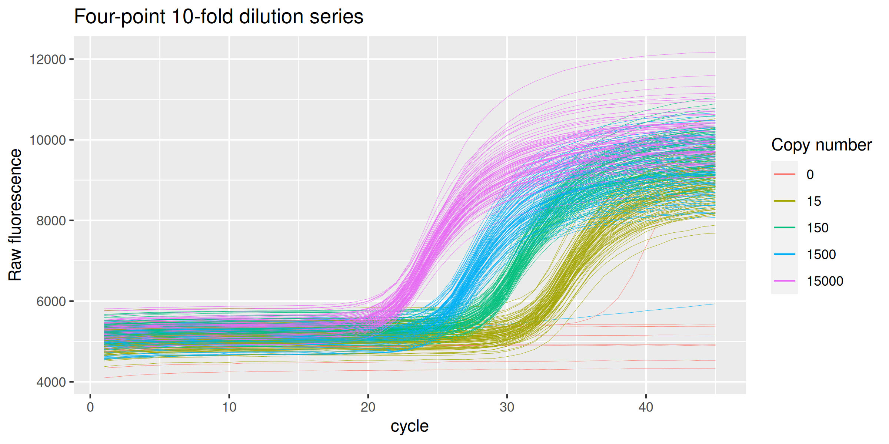
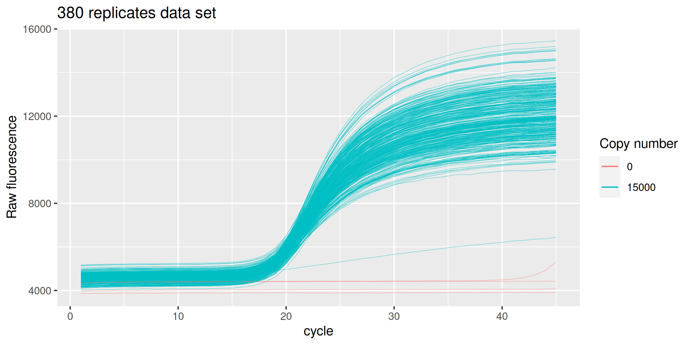
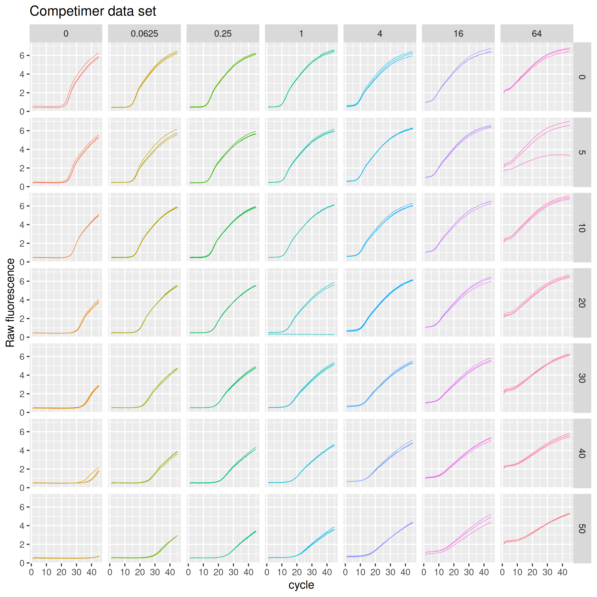

<!-- README.md is generated from README.Rmd. Please edit that file -->

# ruijter

<!-- badges: start -->

[](https://CRAN.R-project.org/package=ruijter)
<!-- badges: end -->

`{ruijter}` is an R data package that provides the real-time qPCR
technical data sets used in [Ruijter et al.
(2013)](https://doi.org/10.1016/j.ymeth.2012.08.011) in tidy format,
namely:

- The 94-replicates-4-dilutions data set: `ds_94_4`
- The 380 replicates data set: `ds_380`
- The competimer data set: `ds_competimer`

## Installation

Install `{ruijter}` from CRAN:

``` r
# Install from CRAN
install.packages("ruijter")
```

You can install the development version of `{ruijter}` like so:

``` r
# install.packages("remotes")
remotes::install_github("ramiromagno/ruijter")
```

## Usage

### Four-point 10-fold dilution series `ds_94_4`

``` r
library(ruijter)

head(ds_94_4)
#> # A tibble: 6 × 9
#>   well  replicate dye   target sample_type copies dilution cycle fluor
#>   <fct> <fct>     <fct> <fct>  <fct>        <int>    <dbl> <int> <dbl>
#> 1 A1    1         SYBR  MYCN   ntc              0      Inf     1 5202.
#> 2 A1    1         SYBR  MYCN   ntc              0      Inf     2 5229.
#> 3 A1    1         SYBR  MYCN   ntc              0      Inf     3 5252.
#> 4 A1    1         SYBR  MYCN   ntc              0      Inf     4 5256.
#> 5 A1    1         SYBR  MYCN   ntc              0      Inf     5 5270.
#> 6 A1    1         SYBR  MYCN   ntc              0      Inf     6 5282.

dplyr::count(ds_94_4, well, replicate, sample_type, copies)
#> # A tibble: 384 × 5
#>    well  replicate sample_type copies     n
#>    <fct> <fct>     <fct>        <int> <int>
#>  1 A1    1         ntc              0    45
#>  2 A2    2         ntc              0    45
#>  3 A3    1         std          15000    45
#>  4 A4    1         std            150    45
#>  5 A5    2         std          15000    45
#>  6 A6    2         std            150    45
#>  7 A7    3         std          15000    45
#>  8 A8    3         std            150    45
#>  9 A9    4         std          15000    45
#> 10 A10   4         std            150    45
#> # … with 374 more rows

ds_94_4 %>%
  ggplot(mapping = aes(x = cycle, y = fluor, group = well, col = as.character(copies))) +
  geom_line(size = 0.1) +
  labs(y = "Raw fluorescence", colour="Copy number", title = "Four-point 10-fold dilution series") +
  guides(color = guide_legend(override.aes = list(size = 0.5)))
#> Warning: Using `size` aesthetic for lines was deprecated in ggplot2 3.4.0.
#> ℹ Please use `linewidth` instead.
```



### Replicates for assessment of precision `ds_380`

``` r
head(ds_380)
#> # A tibble: 6 × 9
#>   well  replicate dye   target sample_type copies dilution cycle fluor
#>   <fct> <fct>     <fct> <fct>  <fct>        <int>    <dbl> <int> <dbl>
#> 1 A1    1         SYBR  MYCN   std         150000        1     1 4340.
#> 2 A1    1         SYBR  MYCN   std         150000        1     2 4365.
#> 3 A1    1         SYBR  MYCN   std         150000        1     3 4381.
#> 4 A1    1         SYBR  MYCN   std         150000        1     4 4386.
#> 5 A1    1         SYBR  MYCN   std         150000        1     5 4398.
#> 6 A1    1         SYBR  MYCN   std         150000        1     6 4400.

dplyr::count(ds_380, well, replicate, sample_type, copies)
#> # A tibble: 384 × 5
#>    well  replicate sample_type copies     n
#>    <fct> <fct>     <fct>        <int> <int>
#>  1 A1    1         std         150000    45
#>  2 A2    2         std         150000    45
#>  3 A3    3         std         150000    45
#>  4 A4    4         std         150000    45
#>  5 A5    5         std         150000    45
#>  6 A6    6         std         150000    45
#>  7 A7    7         std         150000    45
#>  8 A8    8         std         150000    45
#>  9 A9    9         std         150000    45
#> 10 A10   10        std         150000    45
#> # … with 374 more rows

ds_380 %>%
  ggplot(mapping = aes(x = cycle, y = fluor, group = well, col = as.factor(copies))) +
  geom_line(size = 0.1) +
  labs(y = "Raw fluorescence", colour="Copy number", title = "380 replicates data set") +
  guides(color = guide_legend(override.aes = list(size = 0.5)))
```



### Competimer primers for PCR efficiency modulation `ds_competimer`

``` r
head(ds_competimer)
#> # A tibble: 6 × 10
#>   well  replicate dye     pct  conc target sample_type dilution cycle fluor
#>   <fct> <fct>     <fct> <dbl> <dbl> <fct>  <fct>          <dbl> <int> <dbl>
#> 1 <NA>  1         SYBR      0    64 AluSx  std                1     1  2.02
#> 2 <NA>  1         SYBR      0    64 AluSx  std                1     2  2.30
#> 3 <NA>  1         SYBR      0    64 AluSx  std                1     3  2.32
#> 4 <NA>  1         SYBR      0    64 AluSx  std                1     4  2.36
#> 5 <NA>  1         SYBR      0    64 AluSx  std                1     5  2.42
#> 6 <NA>  1         SYBR      0    64 AluSx  std                1     6  2.55

dplyr::count(ds_competimer, well, pct, conc, replicate, sample_type)
#> # A tibble: 147 × 6
#>    well    pct   conc replicate sample_type     n
#>    <fct> <dbl>  <dbl> <fct>     <fct>       <int>
#>  1 <NA>      0 0      1         ntc            45
#>  2 <NA>      0 0      2         ntc            45
#>  3 <NA>      0 0      3         ntc            45
#>  4 <NA>      0 0.0625 1         std            45
#>  5 <NA>      0 0.0625 2         std            45
#>  6 <NA>      0 0.0625 3         std            45
#>  7 <NA>      0 0.25   1         std            45
#>  8 <NA>      0 0.25   2         std            45
#>  9 <NA>      0 0.25   3         std            45
#> 10 <NA>      0 1      1         std            45
#> # … with 137 more rows

ds_competimer %>%
  ggplot(mapping = aes(x = cycle, y = fluor, group = interaction(pct, conc, replicate), col = interaction(pct, conc))) +
  geom_line(size = 0.2) +
  guides(color = "none") +
  labs(y = "Raw fluorescence", title = "Competimer data set") +
  facet_grid(rows = vars(pct), cols = vars(conc))
```



## Terms of use

If you use the data here provided please do not forget to cite the
original work by Ruijter et al. (2013), and this package.

## Code of Conduct

Please note that the `{ruijter}` project is released with a [Contributor
Code of
Conduct](https://contributor-covenant.org/version/2/1/CODE_OF_CONDUCT.html).
By contributing to this project, you agree to abide by its terms.

## References

Jan M. Ruijter, Michael W. Pfaffl, Sheng Zhao, Andrej N. Spiess, Gregory
Boggy, Jochen Blom,Robert G. Rutledge, Davide Sisti, Antoon Lievens,
Katleen De Preter, Stefaan Derveaux, Jan Hellemans, Jo Vandesompele.
*Evaluation of qPCR curve analysis methods for reliable biomarker
discovery: Bias, resolution, precision, and implications*. Methods 59
32–46 (2013). doi:
[10.1016/j.ymeth.2012.08.011](https://doi.org/10.1016/j.ymeth.2012.08.011).
